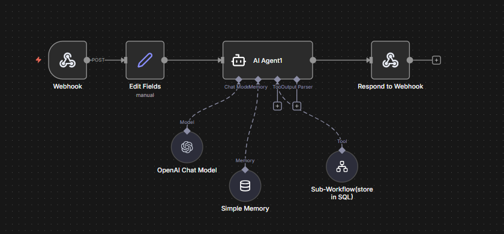
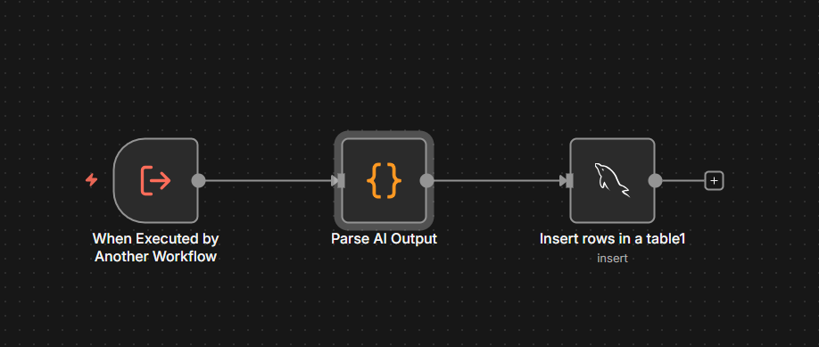

# AI Task Manager

An AI-powered task management system that helps students and users manage their tasks efficiently while integrating an AI agent for discussion, feedback, and task creation.

---


## Overview

As students, we often brainstorm ideas with ChatGPT or similar AI tools and create mindmaps—but remembering everything or manually summarizing discussions into notes is difficult and inefficient.  

The **AI Task Manager** automates this process: you can discuss with the AI agent, receive feedback, and directly add tasks with a single prompt. Tasks are organized efficiently with status tracking and priority management.

---

## Features

- Task organization with **Not Started / Pending / Completed** sections.  
- **AI Agent integration** via n8n workflow for discussion and instant task addition.  
- **Multi-user support** with Google login.  
- Notifications for **upcoming deadlines** and **urgent tasks**.  
- Dashboard displaying **task summary, priority, and status statistics**.  

---

## Demo

<p float="left">
  
  
</p>

<p float="left">
  
  
</p>


---

## N8N Workflows:

<p float="left">
  
  
</p>

---
## Tech Stack

- **Frontend:** HTML, CSS, JavaScript  
- **Backend:** Node.js, Express  
- **Database:** MySQL (Railway hosting)  
- **AI Integration:** n8n workflow (Webhook connected to AI agent)  

---

## Setup & Installation

1. **Clone the repository:**

```bash
git clone <your-repo-link>
cd AI-Task-Manager
